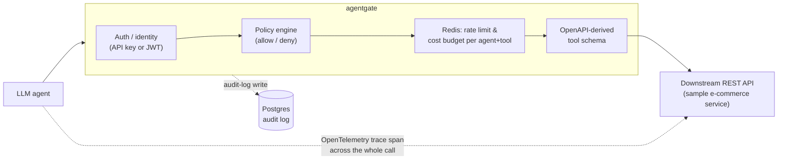

# agentgate

**A policy-and-budget-enforcing gateway between LLM agents and your internal REST APIs.**


## The problem

Every team wiring an LLM agent up to real internal APIs hits the same wall: the agent
needs *some* credential to call your order system, your CRM, your billing API - but
handing an agent a raw service-account key is how you end up reading an incident
report titled "agent looped 40,000 times and refunded every order from Tuesday."

Teams bolt this on ad hoc - a shared API key here, a `if tool_name == "delete"` check
there - and it falls apart the moment there's more than one agent, more than one tool,
or a genuinely runaway loop. What's actually needed looks a lot like an API gateway,
except the caller is a model instead of a service, so the controls have to be shaped
around *tool calls* rather than routes: per-agent identity, an allow/deny policy over
which tools an agent may invoke, hard spend and rate ceilings per agent *and* per tool,
and a full audit trail you can point at an incident and ask "show me exactly what this
agent did, and let me replay it."

agentgate is that gateway. Point it at an OpenAPI spec, and it auto-derives a
function-calling tool catalog; register agents with scoped API keys; write allow/deny
policy rules; set per-agent-per-tool rate limits and cost budgets backed by Redis; and
every single call - allowed or denied - lands in a Postgres audit log with a replay
endpoint and an OpenTelemetry trace spanning the whole request.

## Architecture



Every `/v1/invoke` call walks the same pipeline, all under one root trace span:

1.  **Auth** - resolve the calling `Agent` from an `X-API-Key` header or a short-lived
    JWT (exchanged for the key at `/v1/auth/token`).
2.  **Policy** - evaluate the agent's allow/deny rules (glob patterns like `orders.*`,
    priority-ordered, fail-closed) against the requested tool name.
3.  **Rate limit & budget** - Redis-backed, scoped per `(agent, tool)`: a one-minute
    request-count window and a rolling daily cost-cents budget, both using a
    reserve-then-compensate pattern so a denied call never burns quota.
4.  **Proxy** - translate the tool call into a real HTTP request against the
    downstream API, using routing metadata derived from its OpenAPI spec.
5.  **Audit** - every attempt (allowed, denied, or errored) is written to Postgres,
    including the trace id, latency, and estimated cost. Any log entry can be replayed
    through `/v1/audit/{id}/replay`, which re-runs it through the *current* policy and
    budget state.

## Quick start

### Option A: Docker Compose (Postgres + Redis + sample API + gateway)

```bash
docker compose up -d --build
curl http://localhost:8000/health

# Register an agent (default admin key is set in docker-compose.yml)
curl -X POST http://localhost:8000/v1/agents \
  -H "X-Admin-Key: change-me-in-real-deployments" \
  -H "Content-Type: application/json" \
  -d '{"name": "shopping-agent", "rate_limit_per_minute": 30, "daily_cost_budget_cents": 100}'

# Grant it a tool
curl -X POST http://localhost:8000/v1/policies \
  -H "X-Admin-Key: change-me-in-real-deployments" \
  -H "Content-Type: application/json" \
  -d '{"agent_id": "<id from above>", "tool_pattern": "list_products", "effect": "allow"}'

# Call it as the agent
curl -X POST http://localhost:8000/v1/invoke \
  -H "X-API-Key: <api_key from above>" \
  -H "Content-Type: application/json" \
  -d '{"tool": "list_products", "arguments": {}}'
```

Or run the scripted version of exactly this, including a policy denial, a rate-limit
trip, and an audit replay:

```bash
python demo/demo_agent.py
```

### Option B: Local Python (SQLite + fakeredis, zero external services)

```bash
python3.11 -m venv .venv && source .venv/bin/activate
pip install -r requirements-dev.txt

# terminal 1: the "internal" API agentgate fronts
uvicorn sample_api.main:app --port 9000

# terminal 2: the gateway itself
AGENTGATE_DOWNSTREAM_BASE_URL=http://localhost:9000 uvicorn app.main:app --port 8000

# terminal 3
AGENTGATE_URL=http://localhost:8000 python demo/demo_agent.py
```

### Running the tests

Fully offline - SQLite in place of Postgres, [fakeredis](https://github.com/cunla/fakeredis-py)
in place of Redis, and the sample API wired in-process via httpx's ASGI transport in
place of a network hop. No Docker daemon, no network access, no secrets required.

```bash
pip install -r requirements-dev.txt
pytest -q                                    # 81 tests
ruff check app sample_api demo tests         # lint
pytest --cov=app --cov-report=term-missing   # 99% line coverage
```

## How it works

### Tool schemas from your OpenAPI spec

`app/openapi_tools.py` walks an OpenAPI 3.x document and turns every
`{path, method}` operation into a function-calling tool definition - name,
description, and a JSON-schema `parameters` object - plus a parallel `ToolRoute`
recording exactly how to replay it (which params are path vs. query, whether there's
a JSON body). Point `AGENTGATE_OPENAPI_SPEC_PATH` at any spec; the bundled one
(`demo/ecommerce_openapi.json`) is generated straight from the sample e-commerce API
in `sample_api/`.

```
GET /orders/{order_id}  ->  {"name": "get_order", "parameters": {"order_id": {...required}}}
POST /orders             ->  {"name": "create_order", "parameters": {"body": {...}}}
```

`GET /v1/tools/allowed` returns only the subset of tools a given agent's policy
currently permits - that's what you actually hand an LLM as its tool list, so it's
structurally incapable of even being offered a tool it can't call.

### Auth

Two ways to authenticate: a long-lived `X-API-Key: agtk_...` (only its SHA-256 hash
is ever stored), or a short-lived JWT obtained by exchanging that key at
`POST /v1/auth/token` - useful for agent runtimes that shouldn't hold the raw secret.

### Policy engine

`app/policy.py` is a small, fail-closed allow/deny engine. Rules are `(tool_pattern,
effect, priority, agent_id | null)`; a rule with no `agent_id` is global. Precedence:
**priority first** (so an admin can write one global "kill switch" deny that
overrides every agent's own allow rules mid-incident), then agent-specific over
global, then deny over allow on a true tie. No matching rule at all means **denied**
- there is no implicit allow.

### Rate limits & cost budgets

`app/rate_limit.py` is Redis-backed and scoped per `(agent, tool)` - a runaway loop
on one tool doesn't exhaust a completely different tool's budget. Two independent
guards: a fixed one-minute request-count window, and a rolling daily cost-cents
budget (a stand-in "token cost" that scales with the JSON payload size, mirroring how
LLM token costs scale with request size). Both reserve-then-compensate, so a denied
call is never charged against the caller.

### Audit log & replay

Every attempt - allowed, denied by policy, denied by rate limit, denied by budget, or
even an unknown tool name - is written to Postgres via `app/audit.py`, with the
OpenTelemetry trace id attached. `POST /v1/audit/{id}/replay` re-runs the exact same
tool + arguments through the *same* pipeline (`perform_invoke`), so it's re-evaluated
against whatever the policy and budget state is *right now* - replaying a call from
before an access grant was revoked will (correctly) come back denied.

### Tracing

`app/tracing.py` wires up an OpenTelemetry `TracerProvider`. Every `/v1/invoke` call
opens one root span (`agentgate.invoke`) with child spans for the policy check, the
rate-limit check, the budget check, and the downstream call - so a single trace shows
exactly where time went and exactly which gate rejected a call. No exporter is wired
by default (safe for offline tests); set `AGENTGATE_OTEL_CONSOLE_EXPORT=true` to print
spans, or point an OTLP exporter at the provider for a real deployment.

## Project layout

```
app/
  main.py            FastAPI app factory + lifespan wiring
  config.py           Settings (env-driven, all defaults are offline-safe)
  db.py / models.py   Async SQLAlchemy: Agent, PolicyRule, AuditLog
  auth.py              API key + JWT auth
  policy.py            Allow/deny policy engine
  rate_limit.py        Redis-backed rate limit + cost budget
  openapi_tools.py     OpenAPI spec -> function-calling tool schemas
  proxy.py             Tool call -> real HTTP request against the downstream API
  audit.py             Audit log persistence
  tracing.py            OpenTelemetry wiring
  routers/              agents, policies, tools, gateway (/v1/invoke), audit
sample_api/            The "internal" e-commerce API agentgate fronts
demo/
  demo_agent.py        End-to-end scripted demo agent
  ecommerce_openapi.json  Bundled OpenAPI spec (generated from sample_api)
tests/                 81 tests: auth, policy, rate limit, budget, gateway e2e,
                       audit replay, OpenAPI ingestion, proxy, app bootstrap
```

## What's deliberately out of scope

This project is maintained as a solo portfolio effort, not an enterprise platform: no multi-tenant
org/RBAC layer above "agent," no Alembic migration chain (the app creates its schema
at startup via `create_all`, which is the honest thing to do for a project this size),
and the rate/budget reserve-then-compensate pattern is correct for one agent's
sequential tool calls but isn't a Lua-script-atomic under extreme concurrency - the
extension point (`RateLimiter._redis`) is called out in the code for exactly that
upgrade if you needed it.

## License

MIT - see [LICENSE](LICENSE).

## About the Maintainer

This project is currently maintained by Manmohan S., a Supply Chain Analyst with a strong interest in leveraging technology for operational efficiency. With experience in SQL and Python, Manmohan focuses on developing robust solutions for data analysis and process improvement.

-   **Email**: manmohansangola1@gmail.com
-   **LinkedIn**: [Manmohan Sangola](https://www.linkedin.com/in/manmohan-sangola/)